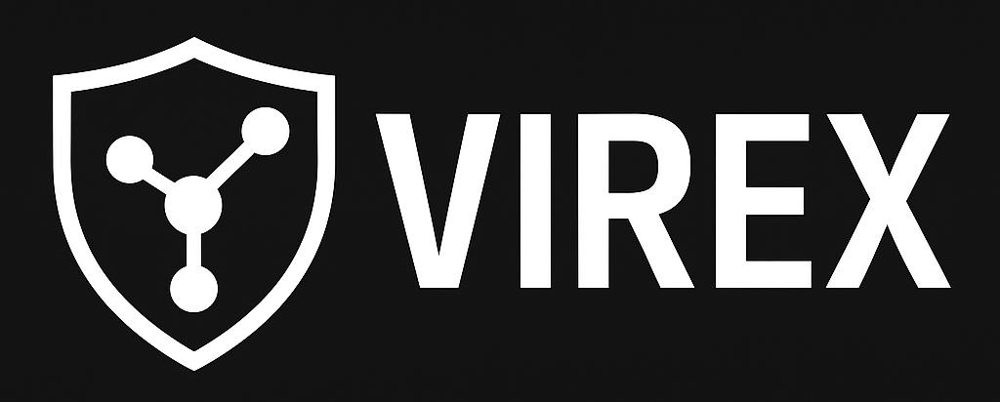

  

# VIREX Protocol – v0.1.0-alpha  
**Author:** Syon Foppen  
**Status:** Alpha – early stage, experimental, not production ready  

---

## ⚠️ Important Learning Disclaimer  

This project exists to **learn about cryptography**, **secure communication protocols**, and **privacy-preserving technologies** by designing and documenting a hypothetical protocol called **VIREX**.  

- It is **not production-ready** and should **not be used as-is**.  
- It has **not been audited** for real-world security.  
- It is **for educational and research purposes only**.  

All designs include **abuse prevention**, **transparency**, and **auditing mechanisms**, but security feedback is highly encouraged as part of the learning process.  

---

## About This Project  

VIREX (**Verifiable Infrastructure for Routing with Encryption and eXtensibility**) is a **learning project** designed to explore:  
- Modern cryptography and mixnet-based privacy systems  
- Metadata protection and anonymous routing  
- Key transparency and anonymous key discovery  
- Abuse resistance and federated governance mechanisms  

The primary goal is to **learn and document** how secure, privacy-preserving communication protocols can be designed, and to invite **public feedback** from the community.  

This project is **not intended for criminal or illegal use**. It exists for **educational and research purposes** only.  

---

## Alpha Disclaimer  

- This is **v0.1.0-alpha**, an **early draft** of the VIREX protocol specification.  
- The protocol design **will change** based on public review and security feedback.  
- **Do not** use this alpha version in production systems.  
- Reference implementations are not yet included in this release – only **specifications, governance documents, and diagrams** are provided.  

---

## Project Goals  

1. Learn and apply modern cryptographic primitives in a real-world protocol context.  
2. Explore **metadata privacy** using mixnets, Poisson delays, and dummy traffic.  
3. Design **end-to-end encryption** and **anonymous key discovery** using verifiable logs.  
4. Include **abuse resistance** (proof-of-work, quotas) to prevent misuse.  
5. Use **federated governance** and **transparent auditing** to ensure trust minimization.  

---

## Repository Structure  

This alpha release focuses on **protocol documentation**, with placeholders for future code and tests.  

VIREX-Protocol/  
├─ README.md # You are here  
├─ CHANGELOG.md # Release notes  
├─ ROADMAP.md # Future plans for v0.2, v1.0  
├─ LICENSE-SPEC # CC BY 4.0 for specifications  
├─ LICENSE-CODE # Apache 2.0 for future code  
├─ CONTRIBUTING.md # Placeholder  
├─ CODE_OF_CONDUCT.md # Placeholder  
├─ SECURITY.md # Placeholder  
│  
├─ spec/ # Full protocol specs (real content)  
│ ├─ VIREX-v0.1.0-alpha.md  
│ ├─ VIREX-Overview.md  
│ ├─ VIREX-DeepDive.md  
│ ├─ ThreatModel.md  
│ ├─ Glossary.md  
│ ├─ UseCasesRequirements.md  
│ └─ RelatedWork.md  
│  
├─ governance/ # Governance model & auditing docs (real content)  
│ ├─ Governance.md  
│ ├─ TransparencyLogs.md  
│ └─ AuditorGuidelines.md  
│  
├─ docs/ # Diagrams & visuals (real content)  
│ ├─ ArchitectureDiagram.png  
│ ├─ MessageLifecycle.png  
│ ├─ ODS-Flow.png  
│ └─ Mailbox-Privacy.png  
│  
├─ reference-impl/ # Placeholder for future reference implementations  
│ ├─ mixnode/  
│ ├─ mailbox/  
│ ├─ ods/  
│ └─ client-sdk-dotnet/  
│  
├─ tests/ # Placeholder for conformance and security tests  
│ ├─ conformance/  
│ ├─ security/  
│ └─ integration/  
│  
└─ .github/ # Placeholder for CI, templates, automation  
├─ ISSUE_TEMPLATE/  
└─ workflows/  

All **placeholder directories** contain a minimal `README.md` stating:  
> Placeholder – will be expanded in future releases.  

---

## Contributing  

- Feedback, suggestions, and reviews are welcome.  
- For issues or improvement ideas, please open a GitHub Issue.  
- For security reports, see **SECURITY.md** (private disclosure recommended).  

This project follows standard open source collaboration practices.  

---

## License  

- **Documentation**: Creative Commons Attribution 4.0 International (CC BY 4.0)  
- **Code** (when added): Apache License 2.0  

See `LICENSE-SPEC` and `LICENSE-CODE` for full text.  

---

## Acknowledgements  

This project draws inspiration from:  
- **Mixnets**: Loopix, Nym, Katzenpost  
- **Key Transparency**: CONIKS, Certificate Transparency  
- **Anonymous Communication Research**: Vuvuzela, Talek, Alpenhorn  
- **Security Engineering Principles**: Privacy by Design, Federated Trust Models  

---

## Next Steps  

- Collect **public feedback** on the alpha specification.  
- Add a **reference implementation** in Rust, Go, and .NET in future versions.  
- Expand **test plans** and **conformance tooling**.  
- Prepare a **public testnet** before v1.0.  

---
