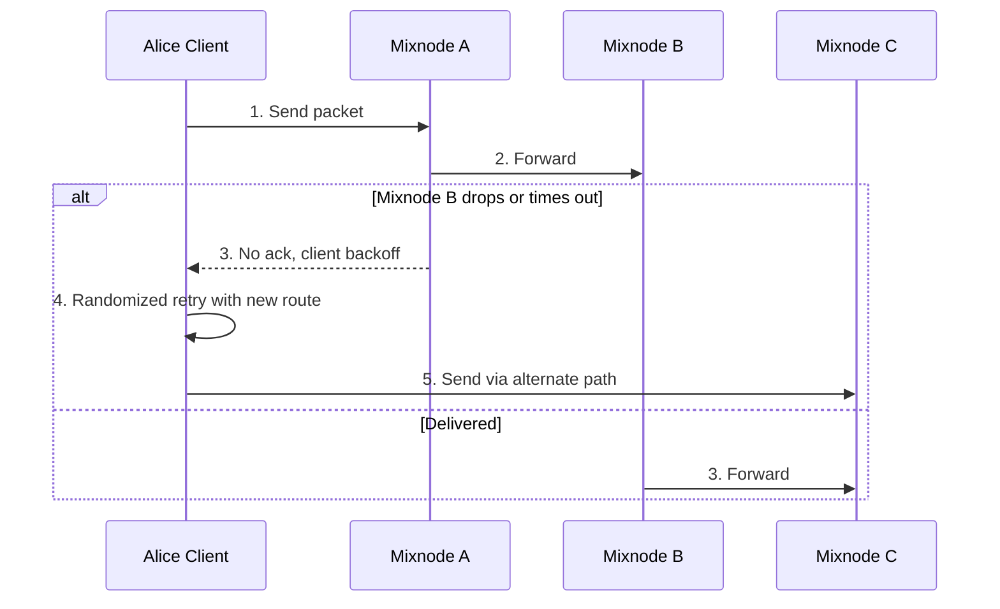

# VIREX Failure and Retry Flow – v0.1.0-alpha

**Author:** Syon Foppen  
**Status:** Alpha – for public feedback only  

---

## 1. Introduction  

This document describes the **failure and retry flow** in the VIREX protocol:  
- How a message is retried if a mixnode fails or drops a packet  
- How randomized backoff and alternate routes improve reliability  
- How the system ensures delivery without exposing metadata  

---

## 2. Participants  

| Participant         | Role in the Flow                                         |
|---------------------|----------------------------------------------------------|
| Alice's Client       | Sends messages, handles retries and alternate paths      |
| Mixnode A            | First hop, forwards to next node or detects failure      |
| Mixnode B            | Intermediate hop, may fail or drop messages              |
| Mixnode C            | Alternate route for retries                              |

---

## 3. Step-by-Step Failure and Retry Flow  

1. Alice sends a packet via Mixnode A → Mixnode B → Mixnode C.  
2. If Mixnode B fails or times out, no acknowledgement is received.  
3. Alice uses randomized backoff before retrying to avoid correlation attacks.  
4. A new route is selected (e.g., via Mixnode C directly).  
5. Message is eventually delivered through alternate path.  

---

## 4. Sequence Diagram  

---

## 5. Reliability Guarantees  

| Threat                      | Mitigation in VIREX                       |
|-----------------------------|--------------------------------------------|
| Node Failure or Drop         | Randomized retries with alternate paths     |
| Timing Correlation Attacks   | Randomized backoff intervals                |
| Single Point of Failure      | Multi-hop routing with redundancy           |

---

## 6. Future Extensions  

- Multipath message delivery for stronger redundancy  
- Reputation system for unreliable nodes  
- Dynamic route selection based on real-time telemetry  

---

## 7. License  

Specification: CC BY 4.0  
Code in future implementations: Apache 2.0  
