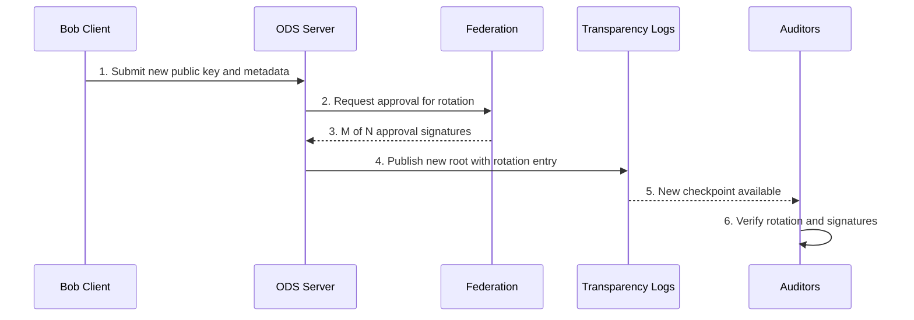

# VIREX Key Rotation Flow – v0.1.0-alpha

**Author:** Syon Foppen  
**Status:** Alpha – for public feedback only  

---

## 1. Introduction  

This document describes the **key rotation flow** in the VIREX protocol:  
- How a client (e.g., Bob) rotates their public key in the Oblivious Directory Service (ODS)  
- How the **Federation** approves the change  
- How **Transparency Logs** and **Auditors** ensure integrity and accountability  

---

## 2. Participants  

| Participant          | Role in the Flow                                  |
|----------------------|---------------------------------------------------|
| Bob's Client          | Initiates key rotation request                     |
| ODS Server            | Receives rotation request, interacts with Federation |
| Federation            | Approves key rotation via M-of-N signatures        |
| Transparency Logs     | Publishes new root with rotation entry             |
| Auditors              | Verify rotation, inclusion, and signatures         |

---

## 3. Step-by-Step Key Rotation Flow  

1. Bob prepares a new public key and metadata.  
2. Submits rotation request to ODS Server.  
3. ODS requests M-of-N approval signatures from Federation.  
4. Once approved, ODS publishes updated root to Transparency Logs.  
5. Auditors verify inclusion and consistency in Transparency Logs.  

---

## 4. Sequence Diagram  

---

## 5. Security Guarantees  

| Threat                   | Mitigation in VIREX                       |
|--------------------------|--------------------------------------------|
| Malicious Key Replacement | Federation approval + Transparency Logs    |
| Key Loss or Expiry        | Explicit rotation process with auditing     |
| Rogue ODS Server          | Auditors verify signatures and checkpoints  |

---

## 6. Future Extensions  

- Post-quantum secure key rotation methods  
- Automated key expiry and renewal policies  
- Zero-knowledge proofs for key integrity  

---

## 7. License  

Specification: CC BY 4.0  
Code in future implementations: Apache 2.0  
